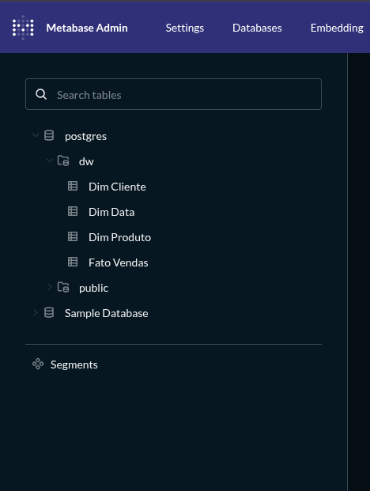

# 🚀 Portfolio Data Engineering

Projeto completo de Engenharia de Dados desenvolvido com Python, PostgreSQL, Docker e Metabase.

O objetivo deste projeto é demonstrar a construção de uma pipeline de dados ponta a ponta, desde um sistema ERP operacional até dashboards analíticos para tomada de decisão.

---

# 📊 Arquitetura

```text
ERP PostgreSQL
      │
      ▼
Raw Layer (Parquet)
      │
      ▼
Curated Layer (Star Schema)
      │
      ▼
Data Warehouse PostgreSQL
      │
      ▼
Analytics Layer
      │
      ▼
Metabase Dashboard
```

---

# 🏗️ Arquitetura de Dados

## ERP (Operational Layer)

Tabelas transacionais:

* clientes
* produtos
* pedidos
* itens_pedido

Relacionamentos:

```text
clientes
    │
    ▼
pedidos
    │
    ▼
itens_pedido
    ▲
    │
produtos
```

---

## Raw Layer

Objetivo:

* Armazenar extrações do ERP sem transformação.
* Preservar histórico bruto.
* Servir como camada de auditoria.

Arquivos:

```text
data/raw/
├── clientes.parquet
├── produtos.parquet
├── pedidos.parquet
└── itens_pedido.parquet
```

---

## Curated Layer

Modelagem dimensional em formato Star Schema.

### Dimensões

```text
dim_cliente
dim_produto
dim_data
```

### Fato

```text
fato_vendas
```

Estrutura:

```text
                dim_cliente
                     │
                     │
                     ▼
dim_data ───► fato_vendas ◄─── dim_produto
```

---

## Data Warehouse

Schema:

```sql
dw
```

Tabelas:

```text
dw.dim_cliente
dw.dim_produto
dw.dim_data
dw.fato_vendas
```

---

## Analytics Layer

Métricas geradas automaticamente:

```text
receita_total
receita_por_cliente
receita_por_produto
receita_por_cidade
ticket_medio
produto_mais_vendido
top_clientes
top_produtos
receita_mensal
```

Arquivos:

```text
data/analytics/
```

---

# ⚙️ Tecnologias Utilizadas

### Linguagens

* Python
* SQL

### Banco de Dados

* PostgreSQL 15

### Processamento

* Pandas
* PyArrow
* SQLAlchemy

### Armazenamento

* Parquet

### Containerização

* Docker
* Docker Compose

### Visualização

* Metabase

### Testes

* Python
* Validações automatizadas

---

# 📁 Estrutura do Projeto

```text
portfolio-data-engineering/
│
├── analytics/
├── config/
├── data/
│   ├── raw/
│   ├── curated/
│   └── analytics/
│
├── docs/
│
├── etl/
│   ├── extract/
│   ├── transform/
│   ├── load/
│   └── quality/
│
├── metabase/
├── sql/
│
├── run_pipeline.py
├── test_project.py
└── README.md
```

---

# 🔄 Pipeline

Execução completa:

```bash
python3 run_pipeline.py
```

Etapas executadas:

```text
1. ERP → Raw
2. Raw → Curated
3. Curated → Analytics
4. Data Quality
5. Testes Automatizados
```

---

# ✅ Data Quality

Validações implementadas:

* Campos obrigatórios
* Valores nulos
* Integridade referencial
* Quantidades positivas
* Preços positivos
* Regras de negócio

Execução:

```bash
python3 etl/quality/data_quality.py
```

Resultado atual:

```text
29 validações executadas
100% aprovadas
```

---

# 🧪 Testes Automatizados

Execução:

```bash
python3 test_project.py
```

Cobertura atual:

```text
69 testes
69 aprovados
100% de sucesso
```

Validações:

* ERP
* Raw Layer
* Curated Layer
* Analytics Layer
* Data Warehouse
* Integridade dos dados
* Estrutura de diretórios
* Schemas

---

# 📈 Dashboard Executivo

KPIs desenvolvidos no Metabase:

* Receita Total
* Ticket Médio

Análises:

* Top 5 Clientes por Receita
* Top 5 Produtos Vendidos
* Receita por Cidade
* Receita Mensal

## Dashboard


---

# 🗄️ Data Warehouse



---

# 📊 Resultados do Projeto

Dados atuais:

| Métrica         |    Valor |
| --------------- | -------: |
| Clientes        |       10 |
| Produtos        |       10 |
| Pedidos         |       20 |
| Itens de Pedido |       46 |
| Receita Total   |   49.070 |
| Ticket Médio    | 2.453,50 |

---

# 🚀 Como Executar

## Clonar

```bash
git clone https://github.com/mesquitaRodrigo/portfolio-data-engineering.git
cd portfolio-data-engineering
```

## Instalar dependências

```bash
pip install -r requirements.txt
```

## Subir PostgreSQL

```bash
docker compose up -d
```

## Executar Pipeline

```bash
python3 run_pipeline.py
```

## Executar Testes

```bash
python3 test_project.py
```

---

# 🎯 Competências Demonstradas

* Engenharia de Dados
* ETL
* Modelagem Dimensional
* Data Warehouse
* PostgreSQL
* Python
* Docker
* Data Quality
* Testes Automatizados
* Business Intelligence
* Metabase
* Arquitetura de Dados

---

# 📬 Contato

GitHub:

https://github.com/mesquitaRodrigo

LinkedIn:

https://www.linkedin.com/in/rodrigo-mesquita-ba817179/
